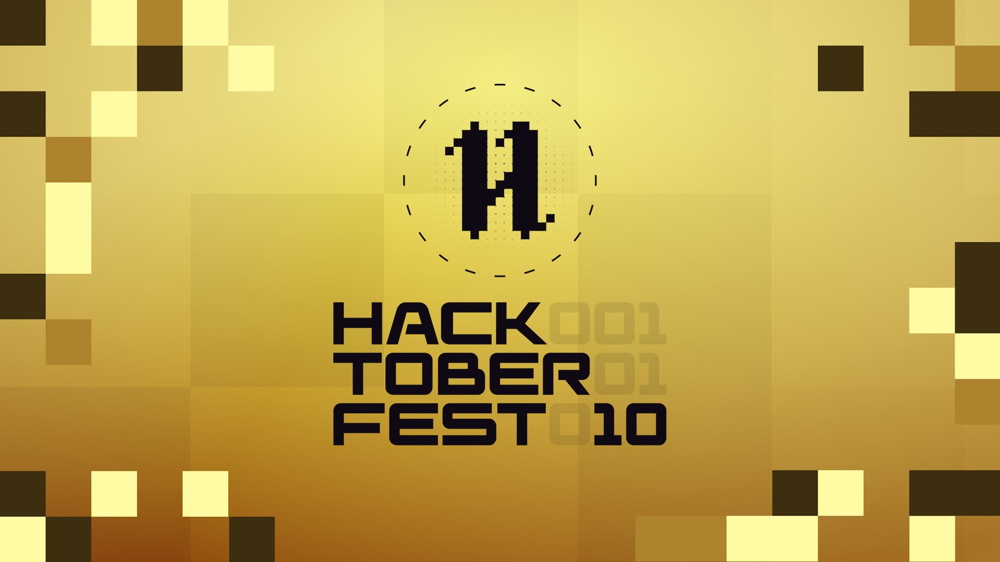

# Hacktoberfest 2023 : React-Aura 🚀

### `STAR`⭐ The Repository `OPEN FIRST` Pull Request & `Get it Merged!` 🎉
🗣 **Hacktoberfest encourages participation in the open source community, which grows bigger every year. Complete the challenge and earn a limited edition rewards!🚀**

📢 **Register [here](https://hacktoberfest.com) for Hacktoberfest and make four pull requests (PRs) between October 1st-31st to get awesome rewards! 🔥.**




# Welcome to React-Aura 🚀
It's a <b>React Component Library</b> created by open-source enthusiasts during <b>Hacktoberfest-2023!</b>

This project aims to create a collection of reusable React components that developers can easily integrate into their applications.

## Getting Started 🤩🤗

Follow these steps to contribute and make your mark on Hacktoberfest 2023:

- Fork the repository
- Clone your forked repository: 
```bash
git clone https://github.com/your-username/Hacktoberfest2023
```
- Navigate to the project directory: 
```bash
cd Hacktoberfest2023
```
- Install dependencies: 
```bash
npm install
```
- Start the development server: 
```bash
npm run dev
```
- Create a new branch for your contribution: 
```bash
git checkout -b your-username
```
- Make your changes in the specific folder in `./src/Components` and commit them: 
```bash 
git commit -m "Added a Transparent Navbar"
```
- Push your changes to your fork: 
```bash
git push origin your-username
```
- Create a Pull Request to the master repository!
1- Get your PR merged 🚀

## Guidelines for Contributions

- Ensure that your component is well-documented and follows best practices.
- Use meaningful names for your components and keep the codebase clean and organized.
- Write clear and concise commit messages.
- Be kind and respectful to other contributors. 

**For more details read [CONTRIBUTING GUIDELINES](CONTRIBUTING.md)**

## Code of Conduct
Please review our **[CODE OF CONDUCT](CODE_OF_CONDUCT.md)** before contributing.

## License
This project is licensed under the **[MIT License](LICENSE)**

### Let's make Hacktoberfest 2023 amazing together! Happy coding! 🎉

## Our Valuable Contributors of `Hacktoberfest 2023`

<div align="center">
<a href="https://github.com/pooranjoyb/React-Aura/graphs/contributors">
  
</a>
</div>
